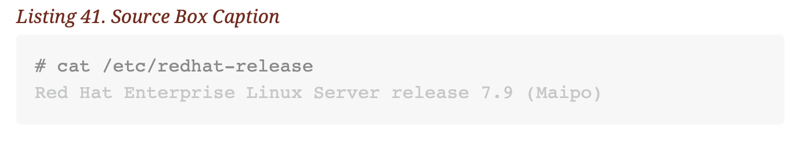

# AsciiDoc Code Snippets

The project for these snippets is being tracked in Github [ADoc Github Snippets Project](https://code.visualstudio.com/api/language-extensions/snippet-guide).

## VS Code API

### Contribution Points

- [`contributes.snippets`](https://code.visualstudio.com/api/references/contribution-points#contributes.snippets)

## Using the ASCIIDoc Snippets

- Install the `Extension` from the Marketplace
- Use (CTRL + Space) Windows/Linux or (Control + Space) MacOS to bring up the snippets selection.
- Choose snippet you want to use.


### Snippets Purpose

The snippets provided here are to easily write and author Asciidoc books. These snippets are for direct use in the [Github Technical Documentation Project](https://github.com/tmichett/Asciidoc_Template) that goes with my Asciidoc Template.


## Snippet Previews

**adoc_source**

```asciidoc
[source,bash]
----
# cat /etc/redhat-release
Red Hat Enterprise Linux Server release 7.9 (Maipo)
----
```




